# IntelliAdmit — Agentic AI University Admission Counsellor

A multi-agent AI system that helps Indian students apply to German universities.
Built with **LangGraph + LangChain + MCP + Hybrid RAG + a LoRA fine-tuned
Mistral-7B**, evaluated with **RAGAS + LLM-as-judge**, and traced with LangSmith.

> Runs end-to-end with **zero credentials** (MOCK mode, only `pydantic`), then
> upgrades to production by filling in `.env`. `12/12` tests pass out of the box.

---

## Architecture

```mermaid
flowchart TD
    U[User query + StudentProfile] --> S{Supervisor<br/>Gemini router}
    S -- respond --> F[Finalize]
    S -- research_eligibility / full_sop / tracker_only --> R[Research Agent]
    S -- scholarship --> SC[Scholarship Agent]

    SC -->|Scholarship MCP<br/>DAAD database| SCM[ScholarshipMatch&#91;&#93;]
    SC --> F

    R -->|Browser MCP<br/>live uni pages| RP[ProgramInfo&#91;&#93;]
    R --> E[Eligibility Agent]
    R -- tracker_only --> T[Tracker Agent]

    E -->|Hybrid RAG<br/>BM25 + Chroma + RRF| ES[Fit scores 0-100]
    E -- full_sop --> SOP[SOP Drafting Agent]
    E -- research_eligibility --> F
    E -- tracker_only --> T

    SOP -->|LoRA Mistral-7B<br/>+ self-critique| SD[SOP draft]
    SD -->|Drive MCP| DR[(Versioned Google Doc)]
    SOP --> T

    T -->|Gmail MCP| GM[(Deadline reminders)]
    T --> F
    F --> OUT[Merged response]

    MEM[(MemorySaver checkpointer<br/>per thread_id)] -.persists.- S
    LS[LangSmith tracing] -.observes.- S
```



The Supervisor classifies each query and routes only the agents needed (lower
latency + cost). All nodes read/write one shared `IntelliAdmitState`, persisted
across sessions by `MemorySaver` keyed on `thread_id`.

---

## Three run modes (env-driven)

| Mode | Trigger | Behaviour |
|------|---------|-----------|
| **MOCK** | no keys | deterministic stubs; full graph still runs |
| **PARTIAL** | `GOOGLE_API_KEY` set | real Gemini agents; mock MCP/SOP |
| **FULL** | + MCP URLs + GPU adapter | live scraping, real SOP, real reminders |

---

## Project layout

```
intelliadmit/
├── config/        settings.py · llm_provider.py        # env + LLM factory (Gemini/Mock)
├── graph/         state.py · supervisor.py · edges.py · builder.py
├── agents/        research · eligibility · sop · tracker
├── rag/           loader · chunker · vectorstore · retriever   # BM25 + Chroma + RRF
├── mcp_tools/     browser · gmail · drive · pdf · base · compat
├── finetuning/    lora_config · dataset · train · inference · evaluate   # QLoRA
├── eval/          ragas_eval · llm_judge · benchmarks/
├── api/           main · routes · schemas · auth          # FastAPI
├── frontend/      React + Vite chat UI
├── data/          uni_docs/ · sop_dataset/ · requirements/
├── tests/         test_agents · test_rag · test_eval      # pytest
└── demo.py        scripted + interactive CLI
```

---

## Quickstart

```bash
# 1. MOCK mode — no keys needed
pip install pydantic
python demo.py                 # runs 3 scripted queries end-to-end
python -m pytest -q            # 12 passed

# 2. Full install
pip install -r requirements.txt
cp .env.example .env           # add GOOGLE_API_KEY, MCP URLs, HF token

# 3. Run the API
uvicorn api.main:app --reload  # http://localhost:8000/docs

# 4. Run the frontend
cd frontend && npm install && npm run dev
```

### Add your own university PDFs
Drop prospectus / admission PDFs into `data/uni_docs/` — the loader ingests them
automatically (PyMuPDF) on next retriever build.

---

## Component notes

**Hybrid RAG** (`rag/retriever.py`) — BM25 (keyword: "CGPA 7.0", "TestDaF B2")
and Chroma dense vectors are each ranked top-5, fused with Reciprocal Rank
Fusion, deduped to top-8, then contextually compressed to relevant sentences.

**Fine-tuning** (`finetuning/`) — QLoRA (4-bit NF4 base + r=16 LoRA on
`q_proj`/`v_proj`, ~0.1% of params) on accepted German SOPs via TRL `SFTTrainer`,
3 epochs, lr 2e-4 cosine. `python -m finetuning.train` (needs a 16GB GPU / Colab
T4). The ~50MB adapter is pushed to the HF Hub and merged at inference.

**Evaluation** (`eval/`) — RAGAS (faithfulness, answer relevance, context
recall/precision) on the RAG path; Gemini LLM-as-judge (motivation, tone, fit,
structure on 1–5) on SOPs, benchmarked vs base Mistral and GPT-4o.

**MCP** (`mcp_tools/`) — Browser (live scraping), Gmail (reminders), Drive (SOP
versioning), custom PDF (transcripts). Each is a LangChain tool that hits a real
MCP server when its URL is set, else returns mock data.

**Program classification** (`graph/state.py`, `agents/eligibility_agent.py`,
`agents/tracker_agent.py`) — every program is tagged on three axes that German
admissions actually diverge on:
- **Institution type** — `university` (research-oriented Universität) vs
  `applied_sciences` (practice-oriented Fachhochschule / HAW). The Eligibility
  Agent scores them differently: an FH rewards work experience and flags a
  pre-study internship (Vorpraktikum); a university rewards academic match.
- **Funding** — `public` (≈free, semester fee only) vs `private` (real tuition).
  Private programs get a `cost_note` and a state-recognition check, and the
  Tracker adds a tuition-funding line item.
- **Intake** — `winter` vs `summer`. Intake is a hard filter (programs not
  offered in the student's `target_intake` are flagged unavailable) and the
  anchor for every deadline the Tracker computes.

Set `target_intake`, `preferred_institution_type`, and `preferred_funding` on the
student profile (UI selectors in `frontend/src/App.jsx`).

**Scholarship Agent** (`agents/scholarship_agent.py`, `mcp_tools/scholarship_tool.py`)
— the 5th agent, routed by the supervisor only on funding queries. Scholarships
are a *separate data source* from admissions, so this agent pulls from the **DAAD
scholarship database** (plus Deutschlandstipendium, Erasmus+) via its own MCP tool,
then filters by the student's `application_level` (`bachelors` vs `masters` — most
DAAD scholarships fund master's and above, not full bachelor's), field, and CGPA.
Every match keeps a `source_url` and a "verify with the provider" flag, since DAAD
itself warns its data may be incomplete. Set `SCHOLARSHIP_MCP_URL` for live data;
blank uses the bundled DAAD snapshot.

---

## Interview map

| Topic | Where in the code |
|-------|-------------------|
| RAG + hybrid retrieval | `rag/retriever.py` (RRF, compression) |
| Agentic AI / LangGraph | `graph/builder.py` (StateGraph, conditional edges, MemorySaver) |
| MCP / tool use | `mcp_tools/*` |
| LoRA / QLoRA fine-tuning | `finetuning/lora_config.py`, `train.py` |
| LLM evaluation | `eval/ragas_eval.py`, `eval/llm_judge.py` |
| Memory / state | `graph/state.py`, MemorySaver checkpointer |
| Multi-agent supervisor | `graph/supervisor.py` |
| Scholarship matching (DAAD) | `agents/scholarship_agent.py`, `mcp_tools/scholarship_tool.py` |
| Human-in-the-loop | `interrupt_before=["sop"]` in `builder.py` |

---

Built by Alli Samhitha · github.com/Samhitha140 · 2026
